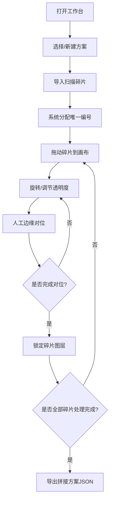

## 1. 产品概述

古地图碎片拼接工作台是面向地图整理专业人员的前端工具，用于将多张经过扫描的古地图碎片通过人工对位拼成一张完整的古地图。系统提供可视化画布、精确操作控制和质量管理，确保拼接过程的准确性和可追溯性。

## 2. 核心功能

### 2.1 用户角色
| 角色 | 注册方式 | 核心权限 |
|------|----------|----------|
| 地图整理员 | 本地使用 | 导入碎片、对位操作、方案管理、导出结果 |

### 2.2 功能模块
1. **主画布区域**：Konva 画布，支持碎片的拖放、旋转、透明度调节、裁边、锁定
2. **左侧操作面板**：碎片导入、属性调节面板（位置/角度/透明度/裁边参数）
3. **右侧信息面板**：拼幅顺序、重叠区域检测、边缘吻合度、未处理碎片列表
4. **顶部工具栏**：方案管理（新建/切换/保存）、导出方案、操作撤销重做
5. **提示系统**：重叠冲突提示、编号重复校验、裁边边界校验、对位完成状态

### 2.3 页面详情
| 页面名称 | 模块名称 | 功能描述 |
|---------|---------|---------|
| 工作台主页 | Konva 画布区 | 可视化展示和操作所有碎片，支持拖动、旋转、缩放、选中高亮 |
| 工作台主页 | 左侧控制面板 | 碎片列表、属性编辑（x/y坐标、旋转角度、透明度、四边裁边量）、锁定/解锁 |
| 工作台主页 | 右侧信息面板 | 拼幅顺序（可拖拽排序）、重叠区域列表（面积计算）、边缘吻合度评分、未处理碎片清单 |
| 工作台主页 | 顶部工具栏 | 方案下拉切换、新建方案、保存方案、导入碎片、导出JSON、撤销、重做 |
| 工作台主页 | 冲突提示层 | 重叠面积超阈值红色闪烁提示、编号重复Toast、裁边越界禁用提示 |

## 3. 核心流程

整理员打开工作台 → 选择或新建方案 → 批量导入扫描碎片 → 系统自动分配唯一编号 → 拖动碎片到画布并旋转对位 → 调节透明度以便观察重叠 → 人工微调边缘对齐 → 对已完成的碎片进行锁定 → 系统实时检测重叠冲突并提示 → 确认全部对位完成 → 导出拼接方案JSON

## 4. 用户界面设计

### 4.1 设计风格
- **主色调**：仿古羊皮纸米色（#F5F0E1）为底，深棕（#3E2723）文字，点缀金棕色（#B8860B）强调
- **辅助色**：选中态用墨蓝（#1E3A5F），冲突告警用朱红（#C62828），完成态用松绿（#2E7D32）
- **按钮风格**：圆角方形（4px），微浮雕效果，hover 轻微上浮阴影
- **字体**：标题用 "Noto Serif SC" 宋体体现古籍质感，正文用 "Noto Sans SC" 保证可读性
- **布局风格**：三栏式固定布局（左控制面板280px + 中央画布自适应 + 右信息面板320px），顶部工具栏60px高
- **图标风格**：Lucide 线性图标，统一 18px 尺寸

### 4.2 页面设计概述
| 页面名称 | 模块名称 | UI 元素 |
|---------|---------|--------|
| 工作台主页 | 顶部工具栏 | 仿古木纹背景条，左侧Logo+标题，中间方案选择下拉框，右侧操作按钮组带分隔线 |
| 工作台主页 | 左侧控制面板 | 卡片式分区，碎片列表项带缩略图+编号+状态标签，属性区用滑块+数字输入框组合 |
| 工作台主页 | 中央画布区 | 深灰网格背景（古地图桌效果），画布带阴影边框，选中碎片显示变换控制柄（旋转/缩放/移动锚点） |
| 工作台主页 | 右侧信息面板 | 4个可折叠卡片区域，重叠区带面积百分比进度条，吻合度用1-5星评分展示 |
| 工作台主页 | Toast/Alert | 右上角浮动提示，冲突时抖动动画，成功时勾选图标 |

### 4.3 响应性
- 桌面端优先设计（最小宽度 1440px）
- 画布区域随窗口缩放自适应
- 侧栏可折叠收起以扩大画布空间
- 触控屏设备支持双指缩放画布

### 4.4 画布交互细节
- 碎片选中：点击选中，边框高亮显示墨蓝色 2px
- 拖动：鼠标左键按住自由移动，锁定状态下禁用
- 旋转：控制柄位于碎片顶部中央，拖拽旋转，按住 Shift 以 15° 步进
- 裁边：四边输入正值向内裁剪，范围校验 0 到 该边长度
- 透明度滑块：0-100%，实时预览
