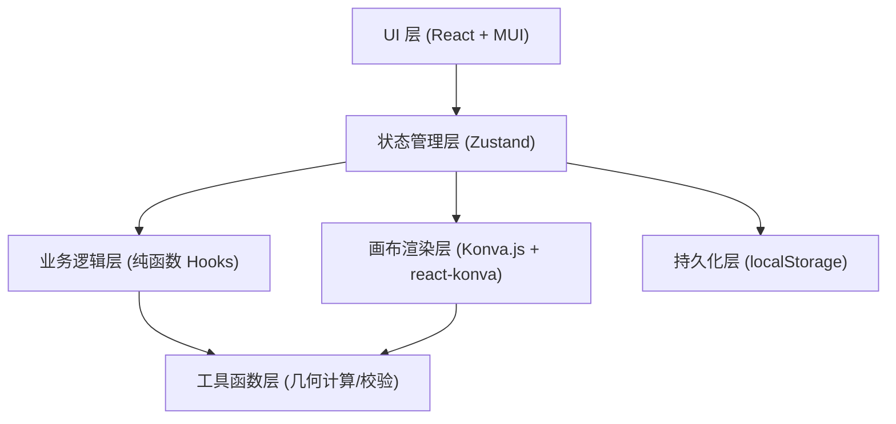
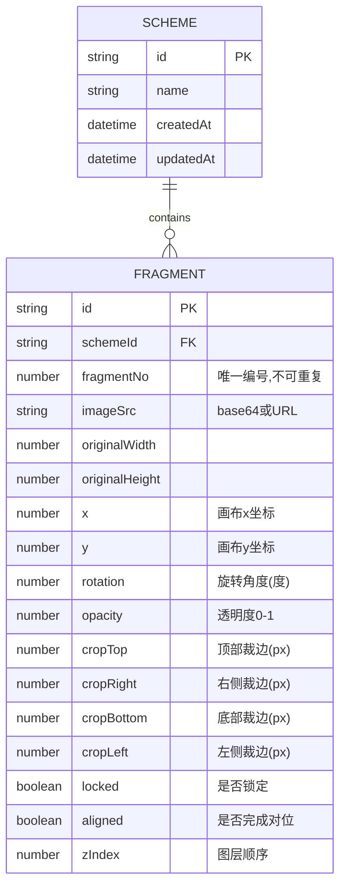

## 1. 架构设计



## 2. 技术说明

- **前端框架**：React 18 + TypeScript 5
- **构建工具**：Vite 5
- **UI 组件库**：MUI (Material-UI) 5（含 @mui/icons-material）
- **画布引擎**：Konva 9 + react-konva 18
- **状态管理**：Zustand 4
- **样式方案**：MUI Theme 定制 + CSS Variables（仿古配色系统）
- **路由**：单页应用，无需多路由
- **持久化**：localStorage 存储方案数据
- **后端**：无，纯前端实现，方案数据以 JSON 导入导出

## 3. 路由定义
| 路由 | 用途 |
|-----|------|
| / | 工作台主页（单页应用唯一入口） |

## 4. 数据模型

### 4.1 数据模型定义



### 4.2 核心类型定义（TypeScript）
```typescript
interface CropEdges {
  top: number;
  right: number;
  bottom: number;
  left: number;
}

interface Fragment {
  id: string;
  schemeId: string;
  fragmentNo: number;
  imageSrc: string;
  originalWidth: number;
  originalHeight: number;
  x: number;
  y: number;
  rotation: number;
  opacity: number;
  crop: CropEdges;
  locked: boolean;
  aligned: boolean;
  zIndex: number;
}

interface Scheme {
  id: string;
  name: string;
  createdAt: number;
  updatedAt: number;
  fragmentMap: Record<string, Fragment>;
  fragmentOrder: string[];
}

interface OverlapInfo {
  fragmentAId: string;
  fragmentBId: string;
  overlapArea: number;
  overlapRatioA: number;
  overlapRatioB: number;
  isConflict: boolean;
}

interface EdgeFitScore {
  fragmentAId: string;
  fragmentBId: string;
  edgeA: 'top' | 'right' | 'bottom' | 'left';
  edgeB: 'top' | 'right' | 'bottom' | 'left';
  score: number;
  gapPixels: number;
}

interface AppState {
  schemes: Record<string, Scheme>;
  activeSchemeId: string | null;
  selectedFragmentId: string | null;
  conflicts: OverlapInfo[];
  history: HistoryEntry[];
  historyIndex: number;
}
```

## 5. 核心业务规则实现

| 规则 | 实现位置 | 触发时机 |
|-----|---------|---------|
| 碎片编号唯一 | useFragmentValidator hook | 导入/修改编号时 |
| 裁边不超出原图 | validateCrop() utils 函数 | 裁边参数变更时，实时校验并 clamp |
| 锁定图层防操作 | Konva Transformer 配置 | locked=true 时禁用 drag/rotate/scale |
| 重叠面积冲突提示 | calculateOverlap() + 阈值判断(默认>30%) | 碎片位置/旋转/裁边变更后重新计算 |
| 未对位不可导出 | exportScheme() 前置检查 | 点击导出时校验所有碎片 aligned=true |
| 方案切换完整恢复 | Zustand store 全量快照 | 切换 activeSchemeId 时完整加载 |

## 6. 工具函数模块

- **geometry.ts**：多边形顶点计算、旋转矩阵变换、重叠区域面积（SAT分离轴算法）、边缘距离计算
- **validators.ts**：编号唯一性校验、裁边边界校验、导出完整性校验
- **uuid.ts**：ID生成器
- **storage.ts**：localStorage 读写封装、JSON 导入导出

## 7. 项目结构
```
src/
├── types/
│   └── index.ts          # 全局类型定义
├── store/
│   └── useAppStore.ts    # Zustand 全局状态
├── hooks/
│   ├── useFragmentOps.ts # 碎片操作逻辑
│   ├── useOverlapDetect.ts # 重叠检测
│   ├── useSchemeManager.ts # 方案管理
│   └── useHistory.ts     # 撤销重做
├── utils/
│   ├── geometry.ts
│   ├── validators.ts
│   ├── storage.ts
│   └── mockData.ts       # 示例碎片数据
├── components/
│   ├── canvas/
│   │   ├── MapCanvas.tsx
│   │   ├── FragmentLayer.tsx
│   │   └── Transformer.tsx
│   ├── left-panel/
│   │   ├── FragmentList.tsx
│   │   ├── PropertyEditor.tsx
│   │   └── ImportButton.tsx
│   ├── right-panel/
│   │   ├── AssemblyOrder.tsx
│   │   ├── OverlapList.tsx
│   │   ├── EdgeFitPanel.tsx
│   │   └── PendingFragments.tsx
│   ├── toolbar/
│   │   ├── AppToolbar.tsx
│   │   └── SchemeSelector.tsx
│   └── common/
│       ├── ConflictAlert.tsx
│       └── Toast.tsx
├── theme/
│   └── index.ts          # MUI 主题定制（仿古配色）
└── App.tsx
```
